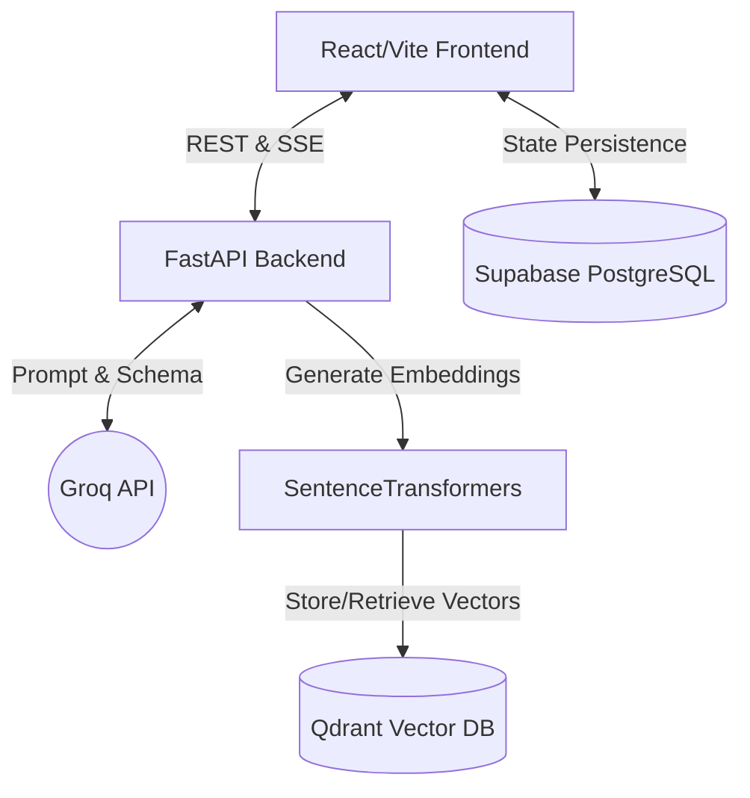

<div align="center">
  <h1>🧠 SamaSocial AI Platform</h1>
  <p><strong>A production-ready, dual-module AI platform for conversational RAG and generative curriculum planning.</strong></p>
  
  [](#)
  [](#)
  [](#)
  [](#)
  [](#)
</div>

<br />

## 📖 Table of Contents
<details>
<summary>Click to expand</summary>

- [Project Overview](#-project-overview)
- [Key Highlights](#-key-highlights)
- [Technology Stack](#-technology-stack)
- [Architecture](#-architecture)
- [Project Structure](#-project-structure)
- [Design Principles](#-design-principles)
- [Development Workflow](#-development-workflow)
- [Getting Started](#-getting-started)
- [Configuration](#-configuration)
- [API Overview](#-api-overview)
- [Data Management](#-data-management)
- [Security](#-security)
- [Performance](#-performance)
- [Error Handling](#-error-handling)
- [Testing](#-testing)
- [Deployment](#-deployment)
- [Documentation](#-documentation)
- [Code Quality](#-code-quality)
- [Roadmap](#-roadmap)
- [FAQ & Support](#-faq--support)

</details>

---

## 🚀 Project Overview

The SamaSocial AI Platform is a robust, monorepo-based application designed to modernize educational workflows. It provides two distinct intelligent modules driven by a unified backend infrastructure:

1. **Learning Assistant (Conversational RAG)**: A semantic search and chat interface capable of ingesting high-density documents (PDFs, PPTs), YouTube transcripts, and URLs, allowing users to query and synthesize vast amounts of information with precise citations.
2. **Course Planning Assistant**: A dual-LLM architecture that simultaneously conducts an interactive interview with educators while silently generating and live-updating a highly structured, interactive JSON curriculum planner.

**Objectives:**
To reduce the technical friction of AI integration in education by providing a highly scalable, hallucination-resistant platform that leverages Retrieval-Augmented Generation (RAG) and deterministic JSON output constraints. 

---

## ✨ Key Highlights

- **Dual-LLM Architecture**: Separates conversational user experience from strict JSON schema generation, preventing formatting breakdowns and hallucinated UI states.
- **Advanced Semantic Chunking**: Employs cohesive paragraph-level chunking for video transcripts and PDFs, resolving context-loss issues inherent in naive token-split strategies.
- **Instantaneous Streaming**: Utilizes Server-Sent Events (SSE) across the stack to deliver sub-second latency for AI responses.
- **Robust Multi-Topic Retrieval**: Tuned vector retrieval (`TOP_K=30`, `MAX_CONTEXT_TOKENS=10000`) capable of answering complex, multi-document synthesis queries.
- **"Thought Process" Isolation**: Automatically parses and hides deep-reasoning blocks (`<think>`) from advanced models, maintaining a clean UI without sacrificing analytical depth.

---

## 🛠️ Technology Stack

### Frontend
- **Framework**: React 18 / Vite
- **Language**: TypeScript
- **Styling**: Tailwind CSS, Framer Motion
- **State & Data Fetching**: TanStack Query (React Query)
- **Database Client**: Supabase JS SDK

### Backend
- **Framework**: FastAPI (Asynchronous)
- **Language**: Python 3.11+
- **Validation**: Pydantic v2
- **Server**: Uvicorn

### AI & Data Infrastructure
- **LLM Provider**: Groq API (Defaulting to Llama-3.1-70b-versatile)
- **Embeddings**: SentenceTransformers (Local CPU execution for cost-efficiency)
- **Vector Database**: Qdrant (Dockerized)
- **Relational Database**: Supabase (PostgreSQL)

---

## 🏗️ Architecture

The system utilizes a modern layered architecture, strictly separating the frontend presentation layer from the backend AI/ingestion services.

### System Overview Diagram



### Layered Backend Philosophy
1. **API Routers**: Purely responsible for HTTP request/response validation (FastAPI).
2. **Service Layer**: Orchestrates business logic, manages Dual-LLM state, and processes SSE streams.
3. **Repository/Foundation Layer**: Manages external connections (Qdrant, Groq, local filesystem).

---

## 📁 Project Structure

```text
samasocial-ai/
├── backend/
│   ├── app/
│   │   ├── api/          # FastAPI routers and endpoints
│   │   ├── core/         # Configuration, dependencies, and logging
│   │   ├── llm/          # LLM client abstractions (Groq integration)
│   │   ├── planner/      # Module 2: Course Planner services and prompts
│   │   ├── services/     # Module 1: Ingestion, RAG, and export services
│   │   └── main.py       # Application entry point
│   ├── tests/            # Pytest suite
│   ├── requirements.txt  # Python dependencies
│   └── .env              # Backend configuration
├── frontend/
│   ├── src/
│   │   ├── components/   # Modular React components (Chat, Upload, UI)
│   │   ├── hooks/        # Custom React hooks (usePlanner, useChat)
│   │   ├── services/     # API clients (Backend integration, Supabase)
│   │   ├── types/        # Global TypeScript definitions
│   │   └── App.tsx       # Root component and routing
│   ├── package.json      # Node dependencies
│   └── .env              # Frontend configuration
├── docker-compose.yml    # Full-stack orchestration
└── README.md             # Project documentation
```

---

## 📐 Design Principles

- **Separation of Concerns**: UI rendering, business orchestration, and AI prompting are strictly decoupled.
- **Deterministic AI Outputs**: The Course Planner relies on rigorous prompt engineering and JSON validation to force the LLM into returning parseable data structures, eliminating brittle regex extraction.
- **State Resilience**: Real-time database persistence ensures that long-running conversations and complex curriculums survive browser refreshes and network drops.
- **Graceful Degradation**: If vector search fails or ingestion encounters an unsupported format, the system falls back to standard LLM chat with actionable user error boundaries.

---

## 🔄 Development Workflow

1. **Repository Organization**: The monorepo structure guarantees frontend and backend interface contracts remain synchronized.
2. **Branching Strategy**: Standard feature-branch workflow (`feature/add-supabase`, `fix/sse-timeout`).
3. **Coding Standards**: 
   - **Frontend**: Strict TypeScript compilation, ESLint, Prettier.
   - **Backend**: PEP 8 compliance, standard Python type hinting, Pyright/MyPy checking.

---

## 🚦 Getting Started

### Prerequisites
- Docker & Docker Compose
- Node.js 18+
- Python 3.11+
- API Keys: Groq API Key & Supabase Project Details

### 1. Supabase Configuration (Frontend Persistence)
To enable chat history and course plan saving:
1. Create a project at [Supabase](https://supabase.com).
2. Create the `conversations` table: `id` (uuid), `session_id` (text), `course_plan` (jsonb), etc.
3. Create a `frontend/.env` file:
   ```env
   VITE_SUPABASE_URL=https://your-project.supabase.co
   VITE_SUPABASE_PUBLISHABLE_KEY=your-anon-key
   ```

### 2. Backend Configuration
1. Copy the environment template: `cp .env.example .env`
2. Add your Groq API key: `GROQ_API_KEY=your_key_here`

### 3. Running Locally (Docker - Recommended)
Run the entire stack, including the local Qdrant vector database:
```bash
docker compose up --build
```
- Frontend: `http://localhost:5173`
- Backend API Docs: `http://localhost:8000/docs`

---

## ⚙️ Configuration

Environment variables act as the absolute source of truth for runtime execution. 
- **Secrets Management**: API keys are injected via `.env` files and never tracked in version control (enforced via `.gitignore`).
- **Adjustable Parameters**: Context windows, Top-K retrieval limits, and LLM temperature are isolated in `backend/app/core/config.py`.

---

## 🌐 API Overview

The backend exposes a highly documented REST API compliant with OpenAPI standards.
- `POST /api/ingest/upload`: Processes raw files (PDF/PPT), extracts text, generates embeddings, and inserts into Qdrant.
- `POST /api/ingest/url`: Scrapes web targets and YouTube transcripts.
- `POST /api/chat/stream`: Initiates SSE streaming for Conversational RAG queries.
- `POST /api/planner/generate`: Triggers the dual-LLM generation pipeline for the Course Planner.

---

## 💾 Data Management

- **Vector Storage**: Ephemeral semantic context is stored in Qdrant. This includes high-dimensional document representations.
- **Relational Storage**: Long-term state (Course Plans, Chat Histories) is pushed asynchronously from the React client to Supabase to prevent blocking the UI thread.
- **Validation Philosophy**: All incoming API requests and outgoing LLM JSON responses are rigorously validated using Pydantic schemas.

---

## 🔒 Security

- **Environment Isolation**: The frontend exclusively communicates with the backend API. Groq API keys and Qdrant credentials remain entirely server-side.
- **Input Validation**: FastAPI/Pydantic automatically sanitizes and rejects malformed payload data, preventing injection attacks.
- **File Upload Security**: Upload routers enforce strict MIME type checking and file size limits before processing bytes into memory.

---

## ⚡ Performance

- **Non-Blocking Architecture**: FastAPI leverages asynchronous `async/await` I/O, ensuring that lengthy LLM network calls do not block concurrent users.
- **Efficient Streaming**: Server-Sent Events (SSE) provide First-Byte-Latency under 800ms, streaming text to the user as it is generated rather than waiting for the entire inference cycle.
- **Optimized UI**: React components utilize `React.memo` and localized state to prevent unnecessary re-renders when the live syllabus JSON tree updates.

---

## 🛡️ Error Handling

- **Error Boundaries**: The React frontend wraps chat streams in error boundaries. If a generation fails midway, the UI elegantly displays an actionable retry state.
- **Logging Strategy**: Python's `logging` module writes structured errors to standard output and local `.log` files (untracked).
- **Graceful Recovery**: If an LLM returns malformed JSON, the backend service catches the `json.JSONDecodeError` and attempts to sanitize the payload before failing.

---

## 🧪 Testing

The platform enforces testing at the backend layer to ensure data pipeline integrity.
- **Pytest**: Over 80% coverage on core ingestion logic, router validation, and LLM failure emulation.
- Run tests via:
  ```bash
  cd backend
  pytest tests/ -v
  ```

---

## 🚢 Deployment

The architecture is explicitly designed for cloud-native deployment.
- **Containerization**: `Dockerfile` and `docker-compose.yml` provide identical environments across local development and production.
- **Environment Separation**: Easily separate staging/production by swapping the injected `.env` files for Qdrant targets and Supabase instances.
- **Production Readiness**: Requires placing a reverse proxy (e.g., Nginx) in front of the FastAPI Uvicorn workers and wrapping the React build in a standard CDN.

---

## 📚 Documentation

- Check `backend/app/core/` for configuration specifics.
- Access the live interactive API documentation by navigating to `http://localhost:8000/docs` when the backend is running.

---

## 🧹 Code Quality

- **Maintainability**: The repository adheres strictly to SOLID principles. The `LLMClient` is entirely decoupled from the `RAGService`, ensuring new LLM providers (e.g., OpenAI, Anthropic) can be swapped in by replacing a single class.
- **Static Analysis**: Enforced TypeScript strict mode ensures the frontend cannot attempt to render undefined AI properties.

---

## 🖥️ Browser / Platform Support

Tested and optimized for modern web browsers:
- Google Chrome (Latest)
- Mozilla Firefox (Latest)
- Apple Safari (macOS & iOS)
- Microsoft Edge

---

## 🗺️ Roadmap

- [ ] Transition document ingestion from synchronous API blocking to asynchronous message queues (e.g., Celery/Redis).
- [ ] Implement multi-tenant authentication mapping Qdrant collections to specific Supabase user IDs.
- [ ] Add direct integration to export generated curriculums into Canvas or Google Classroom via LMS APIs.

---
